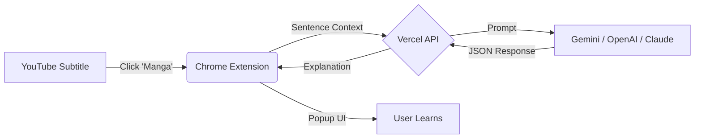

# 🧠 DiciAI - Learn Languages with Context (Powered by AI)

> **Transform YouTube into your personalized language classroom.**  
> Click any word in a subtitle to get instant, context-aware explanations powered by Gemini, OpenAI, or Claude.

---

## 🔮 What is DiciAI?

Traditional dictionaries are dumb. They tell you that "manga" means "fruit" or "sleeve", but they don't know which one you're looking at.

**DiciAI is different.** It reads the entire sentence from the subtitles and uses **Generative AI** (LLMs) to explain exactly what that word means *in that specific moment*.

It detects:
- **Context:** Is it sarcasm? A specific expression? A technical term?
- **Grammar:** Is it a verb, noun, or adjective in this sentence?
- **Formality:** Is this slang? Is it rude? Is it formal?

---

## 🚀 Key Features

### 🧠 True Contextual Understanding
Stop guessing. DiciAI analyzes the surrounding text to give you the **precise definition** for the scene you are watching.

### ⚡ Multi-Provider AI Support
You are in control. Choose the brain that powers your learning:
- **Google Gemini** (Default, fast & smart)
- **OpenAI** (Most common)
- **Anthropic Claude** (Great for nuanced explanations)

### 📚 Integrated Wordbook
Never forget a word. Every lookup is automatically saved to your local **Wordbook**.
- Filter by language
- Sort by date
- Export your vocabulary (coming soon)

### 💸 Flexible Pricing (Free & Unlimited)
- **Free Tier:** 30 smart lookups per day (no account needed).
- **Unlimited:** Add your own API Key (Gemini/OpenAI/Claude) and use it forever without limits.

---

## 🛠️ How it Works

1. **Subtitle Extraction:** The extension detects subtitles on YouTube.
2. **User Interaction:** You click a word you don't know.
3. **Context Analysis:** DiciAI captures the word + the full sentence.
4. **AI Processing:** Our Vercel backend sends this context to your chosen AI provider.
5. **Instant Learning:** You get a structured json response with translation, context, grammar, and formality level.

---

## 📦 Installation

### From Chrome Web Store
*(Link coming soon!)*

---

## 🔮 Roadmap & Future

We are just getting started. Here is what's coming next:

- [ ] **Netflix Support:** Bring the power of DiciAI to your favorite series and movies on Netflix.
- [ ] **Anki/CSV Export:** Export your Wordbook directly to flashcards for Spaced Repetition.
---

## 💻 Tech Stack

- **Frontend:** HTML5, CSS3 (Variables + Glassmorphism), Vanilla JavaScript
- **Backend:** Node.js, Express (Serverless on Vercel)
- **AI Integration:** Google Generative AI SDK, OpenAI API, Anthropic SDK
- **Storage:** Chrome Storage API (Local user data)

---

## 💜 Support the Project

DiciAI is made with coffee and code by [Gabrielly Gomes](https://github.com/codeonthespectrum).

If you love the project and want to support development (or server costs), consider donating via PIX:

**PIX Key:** `de118a69-9797-4dd3-9a5f-f19a03d6e2d2`

---

*Made with 💜 in Brazil.*
